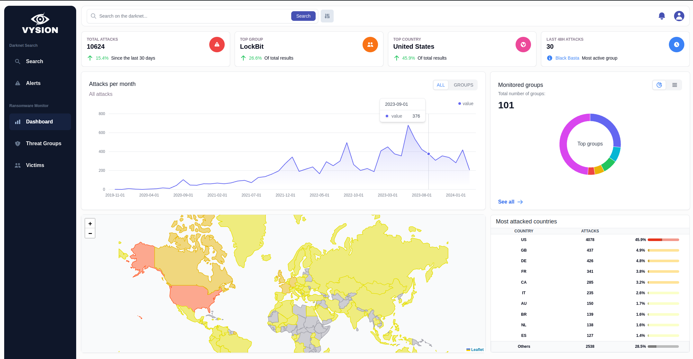
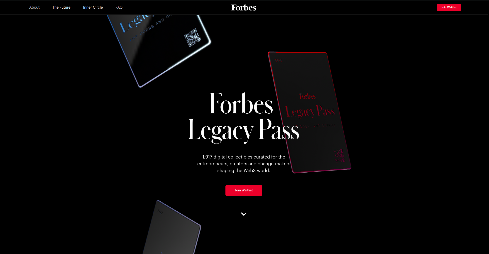
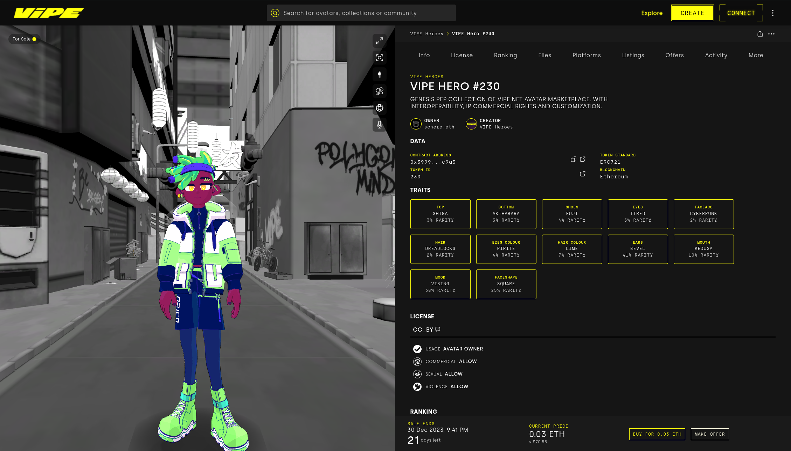
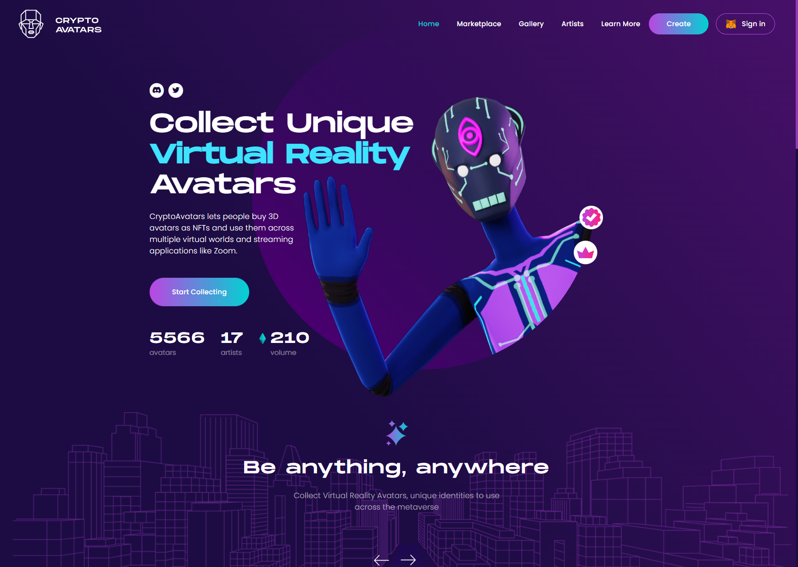
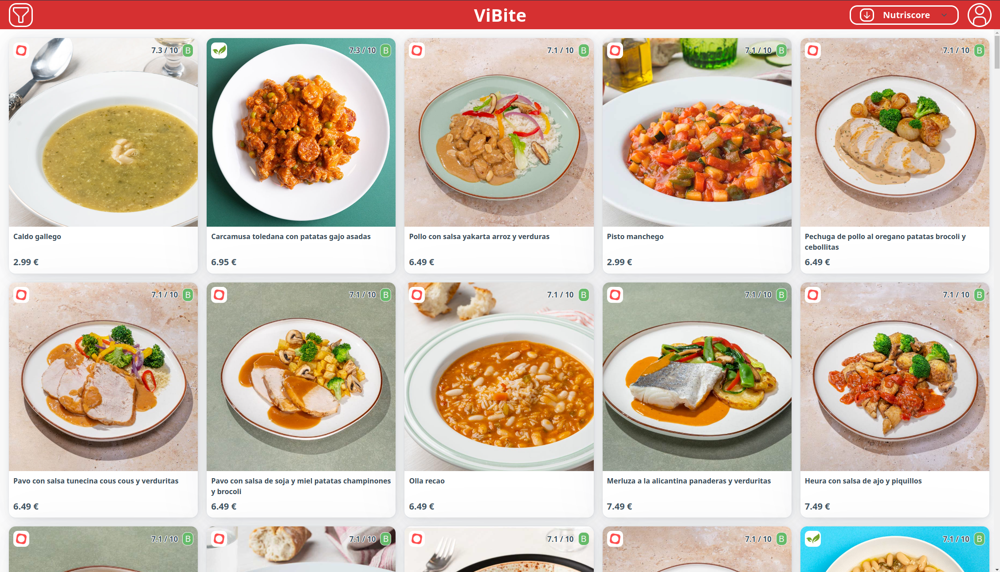
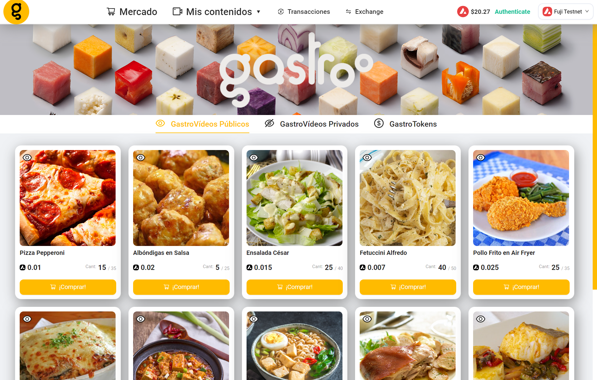

---
title: Manuel R. Schere
subtitle: Cypherpunk Engineer
author: Manuel R. Schere
author-url: "https://github.com/MSchere"
date: 2024-08-31
lang: en
toc-title: Contents
version: v2.0
---

## About me
*Check my CV <a href="cv/Europass_EN.pdf" target="_blank">here</a>*

I'm a **cypherpunk computer engineer** passionate about **blockchain** and **web development**. My drive is to create **innovative solutions** that contribute to a rapidly and ever-evolving digital landscape.

The dynamic nature of blockchain technology keeps me on my toes, constantly **learning** and **adapting**. This aligns perfectly with my love for **continuous growth** and discovery.

Beyond the world of code, I enjoy pumping iron at the gym, losing myself in a good book, exploring virtual worlds in video games and cherishing moments with family and friends.

My journey in tech has taken me through both **decentralized systems** and **traditional finance**, giving me a unique perspective on the potential for innovation in how we interact with **money** and **data**.

At my core, I'm driven by the transformative power of **disruptive technologies** and I'm excited to be part of a movement that's reshaping how we engage with the digital world, each other, and the concept of value itself.

## Studies and Experience

Senior full-stack dev | <a href="https://byronlabs.io" target="_blank">Byron Labs</a>

*January 2024 - Ongoing*

- Design & development of the <a class="accent" href="https://vysion.ai" target="_blank">Vysion</a> platform. A **cyberintelligence** platform that allows organizations to monitor the **dark web** for threat detection and prevention.

- Working in a small 5 person **remote team**.

- Typescript, Next.js, Python, FastApi, Selenium, Elasticsearch, AWS, Docker

Full-stack blockchain dev | <a href="https://www.linkedin.com/company/polygonal-mind" target="_blank">Polygonal Mind</a>

*September 2022 - January 2024*

- Development of the **Virtual Persona** project. A decentralized marketplace to buy, sell or create tokenized avatars ready for multiple metaverses and EVM-compatible blockchains.

- Development of the CA-Marketplace **smart contract**, integration of frontend and backend systems with the supported chains.

- Development of **Web3** projects for external clients such as NFT collections and DAOs.

- Worked in a 10 person **scrum team** on-site.

- Hardhat, Solidity, Typescript, Ethers.js, Angular, Nest.js, OpenZeppelin, Next.js

Consultant | <a href="https://n.world" target="_blank">NWorld</a>

*September 2021 - August 2022*

- Development and maintenance of **wholesale banking systems** for BBVA, a multinational Spanish bank.

- Wrote data reconciliation scripts using **Python** and the **Pandas** library.

- Worked with 2 different multidisciplinary teams on-site.

- MySQL, Java, Kotlin, PHP, Python, Pandas

Master's Degree in Blockchain | <a href="https://universidadeuropea.com/en" target="_blank">UEM</a>

*March 2022 - July 2022*

- Master's degree taken at **Universidad Europea de Madrid**, a prestigious private Spanish university.

- Learned smart contract development using **Solidity** and deployment on various EVM-compatible blockchains such as Ethereum, Polygon and Avalanche.

- Created and administered nodes of the main blockchain networks like Bitcoin, Ethereum and Hyperledger Fabric.

- My final master's degree project was **Gastroo**, a Web3 Dapp that allows foodies to monetize their culinary contents by embedding their recipes into NFTs.

Degree in Computer Engineering | <a href="https://uah.es/en" target="_blank">UAH</a>

*September 2017 - September 2021*

- Engineering degree taken at **Universidad de Alcalá**, a well-known Spanish public university.

- The most challenging 4 years of my life, in which I developed **very varied projects**, some of which include a self-driving car controller, a custom compiler and a fast-food delivery app.

- As my final degree project, I developed a prototype on FreeRTOS of the software run by the EPD ICU (a solar wind measuring device) onboard Solar Orbiter, a satellite launched by the **European Space Agency**.

## Skills

<ul class="tree"><li>
/dev/skills

* frontend
    * next.js
    * react
    * angular
    * sveltekit
* backend
    * nest.js
    * go-fiber
    * fastapi
    * spring-boot
* blockchain
    * solidity
    * hardhat
    * viem
    * ipfs
* databases
    * sql
    * mongodb
    * redis
    * elasticsearch
* devops
    * docker
    * jenkins
    * aws
    * gcp
</li></ul>

## Projects

### Vysion

*Cyberintelligence platform that allows organizations to monitor and analyze the dark web for threat intelligence*

### Forbes Legacy Pass

*Landing page for the oficial Forbes Legacy Pass NFT collection*

### Virtual Persona

*Web3 marketplace where tokenized avatars ready for multiple metaverses and blockchains can be bought, sold or created*

### CryptoAvatars

*Online toolset for tokenized & interoperable avatar creation*

### ViBite

*Online food delivery platform aggregator*

### Gastroo

*Web3 Dapp that allows foodies to monetize their culinary contents by creating NFTs with their recipes embedded onto them*

## Contact

My inbox is always open. Whether you have a question or just want to say hi, I'll try my best to get back to you!

<a href="mailto:manu_schere@proton.me">
<button class="accent" >Get in touch</button>
</a>

